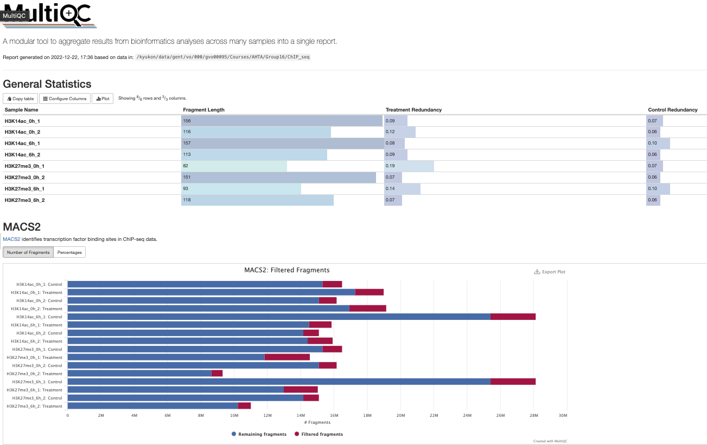

```{r global_options, include=FALSE, message=F, echo=F}
knitr::opts_chunk$set(fig.align = 'center')
knitr::opts_chunk$set(out.width = '90%')
knitr::opts_chunk$set(fig.width=12, fig.height=8)
library("ggplot2")
library("RSQLite")
library("DBI")
library("htmltools")
library("biomaRt")
library("tximport")
library("dplyr")
library("nucleR")
library("DiffBind")
library("GenomicRanges")
library("kableExtra")
library("ggVennDiagram")
library("TxDb.Athaliana.BioMart.plantsmart51")
library("org.At.tair.db")
```

# 1. Data 

## General info

Type: ChIPseq data (E-MTAB-7611)
Data format: bam files, peak bed files
Single/paired end sequencing: Single end sequencing
Platform used: Illumina NextSeq500
Mapping statistics: Reads were mapped to the TAIR10 Arabidopsis genome using Bowtie (option -m 1)

# 2. Preprocessing

Bam files were preprocessed and peak calling was performed using MACS2 package. We used default MACS2 setting and set genome size to be 1.19 X 10^8.

## Quality control

MultiQC result was obtained from HPC
```{r,echo=F,fig.align='center',out.width="90%", out.height="60%",fig.cap="MultiQC result after peak calling",fig.show='hold'}

```

## Load and pre-process Broadpeak data

Read in your peak data (output macs2) and display the head and dimensions of your data object.
```{r}
# Load and rename columns
H3K14ac_0h_1<-read.table("./Data/ChIP-seq/macs2/H3K14ac_0h_1_peaks.broadPeak",header=F)
H3K14ac_0h_2<-read.table("./Data/ChIP-seq/macs2/H3K14ac_0h_2_peaks.broadPeak",header=F)
H3K14ac_6h_1<-read.table("./Data/ChIP-seq/macs2/H3K14ac_6h_1_peaks.broadPeak",header=F)
H3K14ac_6h_2<-read.table("./Data/ChIP-seq/macs2/H3K14ac_6h_2_peaks.broadPeak",header=F)
H3K27me3_0h_1<-read.table("./Data/ChIP-seq/macs2/H3K27me3_0h_1_peaks.broadPeak",header=F)
H3K27me3_0h_2<-read.table("./Data/ChIP-seq/macs2/H3K27me3_0h_2_peaks.broadPeak",header=F)
H3K27me3_6h_1<-read.table("./Data/ChIP-seq/macs2/H3K27me3_6h_1_peaks.broadPeak",header=F)
H3K27me3_6h_2<-read.table("./Data/ChIP-seq/macs2/H3K27me3_6h_2_peaks.broadPeak",header=F)
# set column names
COL_NAMES <- c("seqnames","start","end","id","score","strand","enrichment",
               "log10p","log10q")

colnames(H3K14ac_0h_1)<- COL_NAMES
colnames(H3K14ac_0h_2)<- COL_NAMES
colnames(H3K14ac_6h_1)<- COL_NAMES
colnames(H3K14ac_6h_2)<- COL_NAMES
colnames(H3K27me3_0h_1)<- COL_NAMES
colnames(H3K27me3_0h_2)<- COL_NAMES
colnames(H3K27me3_6h_1)<- COL_NAMES
colnames(H3K27me3_6h_2)<- COL_NAMES
# Preprocess
# Adjust strand data
H3K14ac_0h_1$strand<-as.factor("*")
H3K14ac_0h_2$strand<-as.factor("*")
H3K14ac_6h_1$strand<-as.factor("*")
H3K14ac_6h_2$strand<-as.factor("*")
H3K27me3_0h_1$strand<-as.factor("*")
H3K27me3_0h_2$strand<-as.factor("*")
H3K27me3_6h_1$strand<-as.factor("*")
H3K27me3_6h_2$strand<-as.factor("*")
# rename seqnames
for (i in 1:5){
  H3K14ac_0h_1[H3K14ac_0h_1 == paste0("chr",i)] <- i
  H3K14ac_0h_2[H3K14ac_0h_2 == paste0("chr",i)] <- i
  H3K14ac_6h_1[H3K14ac_6h_1 == paste0("chr",i)] <- i
  H3K14ac_6h_2[H3K14ac_6h_2 == paste0("chr",i)] <- i
  H3K27me3_0h_1[H3K27me3_0h_1 == paste0("chr",i)] <- i
  H3K27me3_0h_2[H3K27me3_0h_2 == paste0("chr",i)] <- i
  H3K27me3_6h_1[H3K27me3_6h_1 == paste0("chr",i)] <- i
  H3K27me3_6h_2[H3K27me3_6h_2 == paste0("chr",i)] <- i
}

H3K14ac_0h_1[H3K14ac_0h_1 == "chrm"] <- "Mt"
H3K14ac_0h_2[H3K14ac_0h_2 == "chrm"] <- "Mt"
H3K14ac_6h_1[H3K14ac_6h_1 == "chrm"] <- "Mt"
H3K14ac_6h_2[H3K14ac_6h_2 == "chrm"] <- "Mt"
H3K14ac_0h_1[H3K14ac_0h_1 == "chrc"] <- "Pt"
H3K14ac_0h_2[H3K14ac_0h_2 == "chrc"] <- "Pt"
H3K14ac_6h_1[H3K14ac_6h_1 == "chrc"] <- "Pt"
H3K14ac_6h_2[H3K14ac_6h_2 == "chrc"] <- "Pt"
H3K27me3_0h_1[H3K27me3_0h_1 == "chrm"] <- "Mt"
H3K27me3_0h_2[H3K27me3_0h_2 == "chrm"] <- "Mt"
H3K27me3_6h_1[H3K27me3_6h_1 == "chrm"] <- "Mt"
H3K27me3_6h_2[H3K27me3_6h_2 == "chrm"] <- "Mt"
H3K27me3_0h_1[H3K27me3_0h_1 == "chrc"] <- "Pt"
H3K27me3_0h_2[H3K27me3_0h_2 == "chrc"] <- "Pt"
H3K27me3_6h_1[H3K27me3_6h_1 == "chrc"] <- "Pt"
H3K27me3_6h_2[H3K27me3_6h_2 == "chrc"] <- "Pt"
```

## GenomicRanges

`GenomicRanges` was used to identify the affected genes.

Import known *A. thaliana* genes
```{r}
# Import bed files with known A. thaliana genes
atgenes <- genes(TxDb.Athaliana.BioMart.plantsmart51)
head(atgenes)
```

Obtain gene IDs based on overlapping regions with reference genome (TAIR10)
```{r}
# Make GRanges object
H3K14ac_0h_1_GR <- with(H3K14ac_0h_1, GRanges(seqnames, IRanges(start+1, end), 
                                strand, score, id, enrichment, log10p, log10q))
H3K14ac_0h_2_GR <- with(H3K14ac_0h_2, GRanges(seqnames, IRanges(start+1, end),
                                strand, score, id, enrichment, log10p, log10q))
H3K14ac_6h_1_GR <- with(H3K14ac_6h_1, GRanges(seqnames, IRanges(start+1, end), 
                                strand, score, id, enrichment, log10p, log10q))
H3K14ac_6h_2_GR <- with(H3K14ac_6h_2, GRanges(seqnames, IRanges(start+1, end), 
                                strand, score, id, enrichment, log10p, log10q))
H3K27me3_0h_1_GR <- with(H3K27me3_0h_1, GRanges(seqnames, IRanges(start+1, end), 
                                strand, score, id, enrichment, log10p, log10q))
H3K27me3_0h_2_GR <- with(H3K27me3_0h_2, GRanges(seqnames, IRanges(start+1, end), 
                                strand, score, id, enrichment, log10p, log10q))
H3K27me3_6h_1_GR <- with(H3K27me3_6h_1, GRanges(seqnames, IRanges(start+1, end), 
                                strand, score, id, enrichment, log10p, log10q))
H3K27me3_6h_2_GR <- with(H3K27me3_6h_2, GRanges(seqnames, IRanges(start+1, end), 
                                strand, score, id, enrichment, log10p, log10q))
# Overlap the enriched regions with known thaliana genes. 
# Obtain TAIR identifiers from overlapping enriched regions
H3K14ac_0h_1_ChIPgenes <- 
  subsetByOverlaps(atgenes, H3K14ac_0h_1_GR, ignore.strand=T)$gene_id
H3K14ac_0h_2_ChIPgenes <- 
  subsetByOverlaps(atgenes, H3K14ac_0h_2_GR, ignore.strand=T)$gene_id
H3K14ac_6h_1_ChIPgenes <- 
  subsetByOverlaps(atgenes, H3K14ac_6h_1_GR, ignore.strand=T)$gene_id
H3K14ac_6h_2_ChIPgenes <- 
  subsetByOverlaps(atgenes, H3K14ac_6h_2_GR, ignore.strand=T)$gene_id
H3K27me3_0h_1_ChIPgenes <- 
  subsetByOverlaps(atgenes, H3K27me3_0h_1_GR, ignore.strand=T)$gene_id
H3K27me3_0h_2_ChIPgenes <- 
  subsetByOverlaps(atgenes, H3K27me3_0h_2_GR, ignore.strand=T)$gene_id
H3K27me3_6h_1_ChIPgenes <- 
  subsetByOverlaps(atgenes, H3K27me3_6h_1_GR, ignore.strand=T)$gene_id
H3K27me3_6h_2_ChIPgenes <- 
  subsetByOverlaps(atgenes, H3K27me3_6h_2_GR, ignore.strand=T)$gene_id
```

Only consider genes that occurred from both replicates
```{r}
H3K14ac_0h_ChIPgenes <- 
  Reduce(intersect, list(H3K14ac_0h_1_ChIPgenes, H3K14ac_0h_2_ChIPgenes))
H3K14ac_6h_ChIPgenes <- 
  Reduce(intersect, list(H3K14ac_6h_1_ChIPgenes, H3K14ac_6h_2_ChIPgenes))
H3K27me3_0h_ChIPgenes <- 
  Reduce(intersect, list(H3K27me3_0h_1_ChIPgenes, H3K27me3_0h_2_ChIPgenes))
H3K27me3_6h_ChIPgenes <- 
  Reduce(intersect, list(H3K27me3_6h_1_ChIPgenes, H3K27me3_6h_2_ChIPgenes))
```

Extract gene annotations from genome wide annotation database using TAIR identifiers
```{r warning=F}
# Note: Some genes have more than one symbols
H3K14ac_0h_ChIPgenes <- AnnotationDbi::select(org.At.tair.db, 
keys=H3K14ac_0h_ChIPgenes, c("SYMBOL", "ENTREZID","GENENAME"), keytype = 'TAIR')
H3K14ac_6h_ChIPgenes <- AnnotationDbi::select(org.At.tair.db, 
keys=H3K14ac_6h_ChIPgenes, c("SYMBOL", "ENTREZID","GENENAME"), keytype = 'TAIR')
H3K27me3_0h_ChIPgenes <- AnnotationDbi::select(org.At.tair.db, 
keys=H3K27me3_0h_ChIPgenes, c("SYMBOL", "ENTREZID","GENENAME"), keytype = 'TAIR')
H3K27me3_6h_ChIPgenes <- AnnotationDbi::select(org.At.tair.db, 
keys=H3K27me3_6h_ChIPgenes, c("SYMBOL", "ENTREZID","GENENAME"), keytype = 'TAIR')
# Change column names
colnames(H3K14ac_0h_ChIPgenes) <- c("tair","Gene_Symbol","Entrez_ID","Gene_name")
colnames(H3K14ac_6h_ChIPgenes) <- c("tair","Gene_Symbol","Entrez_ID","Gene_name")
colnames(H3K27me3_0h_ChIPgenes) <- c("tair","Gene_Symbol","Entrez_ID","Gene_name")
colnames(H3K27me3_6h_ChIPgenes) <- c("tair","Gene_Symbol","Entrez_ID","Gene_name")
```

## Venn diagram
Summary of genes associated  with Venn Diagram
```{r}
ggVennDiagram(list(H3K14ac_0h=unique(H3K14ac_0h_ChIPgenes$tair),
                   H3K14ac_6h=unique(H3K14ac_6h_ChIPgenes$tair))) + 
  scale_fill_gradient(low = "#F4FAFE", high = "#4981BF")
ggVennDiagram(list(H3K27me3_0h=unique(H3K27me3_0h_ChIPgenes$tair),
                   H3K27me3_6h=unique(H3K27me3_6h_ChIPgenes$tair))) + 
  scale_fill_gradient(low = "#F4FAFE", high = "#4981BF")
```

# 3. Differential Binding Analysis (DBA)
DBA was performed to identify sites that are differentially bound after wounding.

## Reading in the peaksets
For DBA, bam files for input control, samples and peaks.bed files were needed. In this analysis, we used data from E-MTAB-7611.
```{r}
samples <- read.csv("./Data/ChIP-seq/E-MTAB-7611.csv")
samples_H3K914ac <- samples[grepl("H3K9/14ac", samples$SampleID),]
samples_H3K27me3 <- samples[grepl("H3K27me3", samples$SampleID),]
samples
```

The peaksets for each modification are read separately in using the following DiffBind function
```{r}
wounding_H3K914ac <- dba(sampleSheet=samples_H3K914ac)
wounding_H3K27me3 <- dba(sampleSheet=samples_H3K27me3)
```

Plot a new correlation heatmap
```{r}
plot(wounding_H3K914ac)
plot(wounding_H3K27me3)
```

## Counting reads

Calculate a binding matrix with scores based on read counts for every sample (affinity scores), rather than confidence scores for only those peaks called in a specific sample (occupancy scores)
```{r}
wounding_H3K914ac <- dba.count(wounding_H3K914ac)
wounding_H3K914ac
wounding_H3K27me3 <- dba.count(wounding_H3K27me3)
wounding_H3K27me3
```

Two new columns have been added. The first shows the total number of aligned reads for each sample (the "Full" library sizes). The second is labeled FRiP, which stands for Fraction of Reads in Peaks. This is the proportion of reads for that sample that overlap a peak in the consensus peakset, and can be used to indicate which samples show more enrichment overall. For each sample, multiplying the value in the Reads column by the corresponding FRiP value will yield the number of reads that overlap a consensus peak.
```{r}
info_H3K914ac <- dba.show(wounding_H3K914ac)
info_H3K27me3 <- dba.show(wounding_H3K27me3)
libsizes_H3K914ac <- cbind(LibReads=info_H3K914ac$Reads, 
                           FRiP=info_H3K914ac$FRiP, 
                           PeakReads=round(info_H3K914ac$Reads * info_H3K914ac$FRiP))
rownames(libsizes_H3K914ac) <- info_H3K914ac$ID
libsizes_H3K27me3 <- cbind(LibReads=info_H3K27me3$Reads, 
                           FRiP=info_H3K27me3$FRiP, 
                           PeakReads= round(info_H3K27me3$Reads * info_H3K27me3$FRiP))
rownames(libsizes_H3K27me3) <- info_H3K27me3$ID

rbind(libsizes_H3K914ac, libsizes_H3K27me3)
```

Plot a new correlation heatmap based on the count scores
```{r}
plot(wounding_H3K914ac)
plot(wounding_H3K27me3)
```

## Normalizing the data

As default normalization (based on sequencing depth) of DiffBind is used to normalized data.
```{r}
wounding_norm_H3K914ac <- dba.normalize(wounding_H3K914ac)
wounding_norm_H3K27me3 <- dba.normalize(wounding_H3K27me3)
norm_H3K914ac <- dba.normalize(wounding_norm_H3K914ac, bRetrieve=TRUE)
norm_H3K27me3 <- dba.normalize(wounding_norm_H3K27me3, bRetrieve=TRUE)
normlibs_H3K914ac <- cbind(FullLibSize=norm_H3K914ac$lib.sizes, NormFacs=norm_H3K914ac$norm.factors,
                          NormLibSize=round(norm_H3K914ac$lib.sizes/norm_H3K914ac$norm.factors))
normlibs_H3K27me3 <- cbind(FullLibSize=norm_H3K27me3$lib.sizes, NormFacs=norm_H3K27me3$norm.factors,
                          NormLibSize=round(norm_H3K27me3$lib.sizes/norm_H3K27me3$norm.factors))
rownames(normlibs_H3K914ac) <- info_H3K914ac$ID
rownames(normlibs_H3K27me3) <- info_H3K27me3$ID
rbind(normlibs_H3K914ac, normlibs_H3K27me3)
```
This shows the normalization method used (lib), the calculated normalization factors for each sample, and the full library sizes (which include the total number of reads in the associated .bam files)

## Establishing a model design and contrast

Make contrast using `Condition` factor and added `Replicate` as a blocking factor
```{r}
wounding_norm_H3K914ac <- dba.contrast(wounding_norm_H3K914ac, minMembers=2, 
                         categories=DBA_CONDITION, design=F, block=DBA_REPLICATE)
wounding_norm_H3K27me3 <- dba.contrast(wounding_norm_H3K27me3, minMembers=2, 
                         categories=DBA_CONDITION, design=F, block=DBA_REPLICATE)
wounding_norm_H3K914ac
wounding_norm_H3K27me3
```

Perform differential analysis
```{r}
wounding_DA_H3K914ac <- dba.analyze(wounding_norm_H3K914ac)
wounding_DA_H3K27me3 <- dba.analyze(wounding_norm_H3K27me3)
dba.show(wounding_DA_H3K914ac, bContrasts=TRUE)
dba.show(wounding_DA_H3K27me3, bContrasts=TRUE)
```

From analysis, 86 differentially bound sites were identified for H3K9/14ac after wounding. However, 0 differentially bound sites were found for H3K27me3 after wounding. Since there was no differentially bound sites for H3K27me3, we will only look into H3K9/14ac.
```{r}
plot(wounding_DA_H3K914ac, contrast=1, main="Correlation Heatmap of H3K9/14ac after wounding")
plot(wounding_DA_H3K27me3, contrast=1, main="Correlation Heatmap of H3K27me3 after wounding")
```

```{r}
# Fold represents log fold changes between the before and after wounding
# H3K9/14ac
sum(dba.report(wounding_DA_H3K914ac)$Fold > 0)
sum(dba.report(wounding_DA_H3K914ac)$Fold < 0)
# H3K27me3
sum(dba.report(wounding_DA_H3K27me3)$Fold > 0)
sum(dba.report(wounding_DA_H3K27me3)$Fold < 0)
```
After wounding, 78 bound sites gained and 10 bound sites loss H3K9/14ac modification respectively. And 2 bound sites loss H3K27me3 modification.

## Plotting in DiffBind
### Venn diagrams

Venn diagrams are examined to see any overlaps between peaksets.
Note: Venn diagram for H3K27me3 modification after wounding was not examined since there was no loss of modification from the analysis.
```{r}
dba.plotVenn(wounding_DA_H3K914ac, contrast=1, bDB=TRUE,bGain=TRUE, bLoss=TRUE, bAll=FALSE)
```

There was no overlaps between peaksets.

### PCA plots
```{r}
dba.plotPCA(wounding_DA_H3K914ac,DBA_CONDITION,label=DBA_REPLICATE)
dba.plotPCA(wounding_DA_H3K27me3,DBA_CONDITION,label=DBA_REPLICATE)
```
From PCA plot, we can observe samples before wounding are largely differ within replicates. This shows that adding `Replicate` as a blocking factor was crucial for our analysis.

### MA plots
```{r}
dba.plotMA(wounding_DA_H3K914ac)
dba.plotMA(wounding_DA_H3K27me3)
```
### Volcano plots

```{r}
dba.plotVolcano(wounding_DA_H3K914ac)
dba.plotVolcano(wounding_DA_H3K27me3)
```


## Retrieving the differentially bound sites
```{r warning=F}
# store DBA result as dataframe
DBA_report_H3K914ac <- as.data.frame(dba.report(wounding_DA_H3K914ac))
DBA_report_H3K914ac$seqnames <- as.character(DBA_report_H3K914ac$seqnames)
DBA_report_H3K27me3 <- as.data.frame(dba.report(wounding_DA_H3K27me3))
DBA_report_H3K27me3$seqnames <- as.character(DBA_report_H3K27me3$seqnames)

# rename seqnames: chX -> X
for (i in 1:5){
  DBA_report_H3K914ac[DBA_report_H3K914ac == paste0("ch",i)] <- i
  DBA_report_H3K27me3[DBA_report_H3K27me3 == paste0("ch",i)] <- i
}
# separate regions gained and loss modification
# then save each as GRanges object
# H3K9/14ac
DBA_report_gained_H3K914ac <- DBA_report_H3K914ac[DBA_report_H3K914ac$Fold < 0,]
DBA_report_gained_H3K914ac <- with(DBA_report_gained_H3K914ac, 
GRanges(seqnames, IRanges(start+1, end), strand, Fold, p.value, FDR))
DBA_report_loss_H3K914ac <- DBA_report_H3K914ac[DBA_report_H3K914ac$Fold > 0,]
DBA_report_loss_H3K914ac <- with(DBA_report_loss_H3K914ac, 
GRanges(seqnames, IRanges(start+1, end), strand, Fold, p.value, FDR))
# H3K27me3 (loss modification only)
DBA_report_loss_H3K27me3 <- DBA_report_H3K27me3[DBA_report_H3K27me3$Fold > 0,]
DBA_report_loss_H3K27me3 <- with(DBA_report_loss_H3K27me3, 
GRanges(seqnames, IRanges(start+1, end), strand, Fold, p.value, FDR))

# get gene_id based on overlapping regions
# H3K9/14ac
gained_ChIPgenes_H3K914ac <- subsetByOverlaps(atgenes, DBA_report_gained_H3K914ac, 
                                     ignore.strand=T)$gene_id
loss_ChIPgenes_H3K914ac <- subsetByOverlaps(atgenes, DBA_report_loss_H3K914ac, 
                                   ignore.strand=T)$gene_id
# H3K27me3 (loss modification only)
loss_ChIPgenes_H3K27me3 <- subsetByOverlaps(atgenes, DBA_report_loss_H3K27me3, 
                                     ignore.strand=T)$gene_id

# get gene info based on gene_id from org.At.tair.db
# H3K9/14ac
gained_ChIPgenes_H3K914ac <- AnnotationDbi::select(org.At.tair.db, keys=gained_ChIPgenes_H3K914ac, 
                  c("SYMBOL", "ENTREZID"), keytype = 'TAIR')
loss_ChIPgenes_H3K914ac <- AnnotationDbi::select(org.At.tair.db, keys=loss_ChIPgenes_H3K914ac, 
                  c("SYMBOL", "ENTREZID"), keytype = 'TAIR')
# H3K27me3 (loss modification only)
loss_ChIPgenes_H3K27me3 <- AnnotationDbi::select(org.At.tair.db, keys=loss_ChIPgenes_H3K27me3, 
                  c("SYMBOL", "ENTREZID"), keytype = 'TAIR')
gained_ChIPgenes_H3K914ac
loss_ChIPgenes_H3K914ac
loss_ChIPgenes_H3K27me3
```

# 4. Visualization

For the visualization, region of interests need to be determined. It can be done by combining results from DBA and peak calling.

## Combine results from DBA and peak calling

```{r}
# Greate dataframe having gene_id, coordinates, enrichment gradient
# H3K9/14ac
genes_gained_H3K914ac <- as.data.frame(unique(atgenes[gained_ChIPgenes_H3K914ac$TAIR]))
genes_gained_H3K914ac$enriched <- "+"
genes_gained_H3K914ac$modification <- "H3K9/14ac"
genes_loss_H3K914ac <- as.data.frame(unique(atgenes[loss_ChIPgenes_H3K914ac$TAIR]))
genes_loss_H3K914ac$enriched <- "-"
genes_loss_H3K914ac$modification <- "H3K9/14ac"
# H3K27me3 (loss modification only)
genes_loss_H3K27me3 <- as.data.frame(unique(atgenes[loss_ChIPgenes_H3K27me3$TAIR]))
genes_loss_H3K27me3$enriched <- "-"
genes_loss_H3K27me3$modification <- "H3K27me3"
# combine the result
GOIs <- rbind(genes_gained_H3K914ac, genes_loss_H3K914ac, genes_loss_H3K27me3)
GOIs$gene_symbol <- NA
GOIs$description <- NA
GOIs$H3K14ac_0h <- NA
GOIs$H3K14ac_6h <- NA
GOIs$H3K27me_0h <- NA
GOIs$H3K27me_6h <- NA

colnames(GOIs)[1] <- "chr"
symbols <- AnnotationDbi::select(org.At.tair.db, 
                                 keys=GOIs$gene_id, c("SYMBOL"), keytype = 'TAIR')

for (gene_tair in GOIs$gene_id){
  GOIs[gene_tair,]$gene_symbol <- 
    paste(symbols[grepl(gene_tair, symbols$TAIR),]$SYMBOL, collapse=",")
  GOIs[gene_tair,]$H3K14ac_0h <- 
    ifelse(gene_tair %in% unique(H3K14ac_0h_ChIPgenes$tair), TRUE, FALSE)
  GOIs[gene_tair,]$H3K14ac_6h <- 
    ifelse(gene_tair %in% unique(H3K14ac_6h_ChIPgenes$tair), TRUE, FALSE)
  GOIs[gene_tair,]$H3K27me_0h <- 
    ifelse(gene_tair %in% unique(H3K27me3_0h_ChIPgenes$tair), TRUE, FALSE)
  GOIs[gene_tair,]$H3K27me_6h <- 
    ifelse(gene_tair %in% unique(H3K27me3_6h_ChIPgenes$tair), TRUE, FALSE)
}
```
In total, 78 genes showed enrichment in H3K9/14ac modification after wounding. There was only 1 gene that loss H3K27me3 modification. Among them, descriptions were added to 42 genes that are associated with either methylation, wounding response, DNA template transcription or root development. Also, some of the genes did not have gene_symbol so they were added manually with suiting gene symbol or explanation. Rest of the genes that are unrelated and transcripts of hypothetical proteins were not annotated. From those 42 genes, there were 7 and 35 genes that loss and gained H3K9/14ac modification after wounding respectively.
```{r}
# chip_seq_annotation.csv was made manually to annotate the genes using TAIR website as a reference
additional <- read.table("./Data/ChIP-seq/chip_seq_annotation.csv", 
                         sep=",", header=T, fill=T)
GOIs[additional$gene_id,]$description <- additional$description
GOIs[additional$gene_id,]$gene_symbol <- additional$gene_symbol

rownames(GOIs) <- c(1:length(GOIs$chr))
GOIs[,c(1,2,3,5,6,7,8,9)] %>%
kbl(caption = "List of genes that have enriched/loss histone modifications", 
    longtable=T, booktabs = T) %>%
    kable_styling(latex_options="striped", position="center", full_width=F)
write.table(GOIs, sep=",", file="ChIP_seq_DBA_MACS2_results.csv", row.names=FALSE)
```

Export regions as a bed file for visualization
```{r}
write.table(GOIs[,c(1,2,3,9)], 
        file="ChIP_seq_ROIs.bed", quote=F, sep="\t", row.names=F, col.names=F)
```

For visualization, the bed file representing region of interest, Broadpreak files generated from MACS2 and BigWig files were used. BigWig files that were averaged with two replicates of bamCoverage files and normalized with RPKM (Reads Per Kilobase Million) method were created using deepTools package. Then, Integrative Genomics Viewer (IGV) from Broad Institute was used for visualization.

# 5. Save results for comparison

```{r}
# Result from DBA
write.table(DBA_report_H3K914ac, sep="\t", file="ChIP_seq_DBA_H3K914ac_results.txt")
write.table(DBA_report_H3K27me3, sep="\t", file="ChIP_seq_DBA_H3K27me3_results.txt")
# Combined results from DBA and MACS2 peak calling results
write.table(GOIs, sep="\t", file="ChIP_seq_DBA_MACS2_results.txt")
```
\newpage
# 6. PBS Files

## Chip_seq_preprocessing.pbs
```
#!/usr/bin/env bash
#PBS -l nodes=1:ppn=8
#PBS -l walltime=03:00:00
#PBS -l mem=24gb

module load SAMtools/1.15-GCC-11.2.0
module load deepTools/3.5.1-foss-2021b

# Change to the directory you are working in 
cd ${VSC_DATA_VO}/Courses/AHTA/Group16/ChIP_seq
mkdir bw

echo "Downloading bam files..."
for URI in $(cat ~/AHTA/project/bam.txt)
do
    echo URI=$URI
    ID="$(echo $URI | cut -d "/" -f11 | cut -d "." -f2)"
    wget $URI
done

echo "Editing chromosome names from bam files..." 
# For E-MTAB-7611.H3_0h.bam file chromosome is labelled differently with other bam files
# Change chromosome labels 'chrX' --> 'chX' using samtools
# This step is necessary for DBA analysis since all peak bed
# files chromosome labels follow 'chX' format
samtools view -h E-MTAB-7611.H3_0h.bam | \
    sed -e '/^@SQ/s/SN\:chr/SN\:ch/' -e '/^@SQ/s/SN\:chPt/SN\:chc/' \
    -e '/^[^@]/s/\tchr/\tch/' -e '/^[^@]/s/\tchPt/\tchc/' | \
    samtools view -bS - > E-MTAB-7611.H3_0h_corrected.bam
rm E-MTAB-7611.H3_0h.bam
mv E-MTAB-7611.H3_0h_corrected.bam E-MTAB-7611.H3_0h.bam

# For visualization, chromosome for all BigWig and Broadtrack files should be 
# labelled as 'chrX'
# Change chromosome labels 'chX' --> 'chrX' using samtools
for n in 0 6
do
    echo "${n}h correcting..."
    # H3
    samtools view -h E-MTAB-7611.H3_${n}h.bam | \
        sed -e '/^@SQ/s/SN\:ch/SN\:chr/' -e '/^[^@]/s/\tch/\tchr/' | \
        samtools view -bS - > bw/E-MTAB-7611.H3_${n}h.bam
    samtools view -h E-MTAB-7611.H3_${n}h_Rep2.bam | \
        sed -e '/^@SQ/s/SN\:ch/SN\:chr/' -e '/^[^@]/s/\tch/\tchr/' | \
        samtools view -bS - > bw/E-MTAB-7611.H3_${n}h_Rep2.bam
    # H3K14ac
    samtools view -h E-MTAB-7611.H3K14ac_${n}h.bam | \
        sed -e '/^@SQ/s/SN\:ch/SN\:chr/' -e '/^[^@]/s/\tch/\tchr/' | \
        samtools view -bS - > bw/E-MTAB-7611.H3K14ac_${n}h.bam
    samtools view -h E-MTAB-7611.H3K14ac_${n}h_Rep2.bam | \ 
        sed -e '/^@SQ/s/SN\:ch/SN\:chr/' -e '/^[^@]/s/\tch/\tchr/' | \
        samtools view -bS - > bw/E-MTAB-7611.H3K14ac_${n}h_Rep2.bam
    # H3K27me3
    samtools view -h E-MTAB-7611.H3K27me3_${n}h.bam | \
        sed -e '/^@SQ/s/SN\:ch/SN\:chr/' -e '/^[^@]/s/\tch/\tchr/' | \
        samtools view -bS - > bw/E-MTAB-7611.H3K27me3_${n}h.bam
    samtools view -h E-MTAB-7611.H3K27me3_${n}h_Rep2.bam | \
        sed -e '/^@SQ/s/SN\:ch/SN\:chr/' -e '/^[^@]/s/\tch/\tchr/' | \
        samtools view -bS - > bw/E-MTAB-7611.H3K27me3_${n}h_Rep2.bam
done

echo "Indexing bam files..." 
for file in ./bw/*.bam
do
    samtools index $file
done

echo "Generating BigWig files..."
for n in 0 6
do
    echo "${n}h"
    bamCompare \
        -b1 bw/E-MTAB-7611.H3K14ac_${n}h.bam \
        -b2 bw/E-MTAB-7611.H3K14ac_${n}h_Rep2.bam -o bw/H3K14ac_${n}h.bw \
        --scaleFactorsMethod None --normalizeUsing RPKM \
        --effectiveGenomeSize 119481543 --operation mean -p 8
    bamCompare \
        -b1 bw/E-MTAB-7611.H3K27me3_${n}h.bam \
        -b2 bw/E-MTAB-7611.H3K27me3_${n}h_Rep2.bam -o bw/H3K27me3_${n}h.bw \
        --scaleFactorsMethod None --normalizeUsing RPKM \
        --effectiveGenomeSize 119481543 --operation mean -p 8
done
echo "Done"
```
\newpage
## ChIP_seq_MACS2.pbs
```
#!/usr/bin/env bash
#PBS -l nodes=1:ppn=4
#PBS -l walltime=02:00:00
#PBS -l mem=16gb

# Load the necessary modules
module load MACS2/2.2.7.1-foss-2021b
module load MultiQC/1.9-intel-2020a-Python-3.8.2

# Change to the directory you are working in 
cd ${VSC_DATA_VO}/Courses/AHTA/Group16/ChIP_seq/bw

echo "MACS2..."
for n in 0 6
do
    echo ${n}h peak calling
    # Peak calling for H3K14ac
    macs2 callpeak -t E-MTAB-7611.H3K14ac_${n}h.bam \
        -c E-MTAB-7611.H3_${n}h.bam \
        -n H3K14ac_${n}h_1 -g 1.19e8 --broad --broad-cutoff 0.1 \
        --outdir macs2
    macs2 callpeak -t E-MTAB-7611.H3K14ac_${n}h_Rep2.bam \
        -c E-MTAB-7611.H3_${n}h_Rep2.bam \
        -n H3K14ac_${n}h_2 -g 1.19e8 --broad --broad-cutoff 0.1 \
        --outdir macs2
    # Peak calling for H3K27me3
    macs2 callpeak -t E-MTAB-7611.H3K27me3_${n}h.bam \
        -c E-MTAB-7611.H3_${n}h.bam \
        -n H3K27me3_${n}h_1 -g 1.19e8 --broad --broad-cutoff 0.1 \
        --outdir macs2
    macs2 callpeak -t E-MTAB-7611.H3K27me3_${n}h_Rep2.bam \
        -c E-MTAB-7611.H3_${n}h_Rep2.bam \
        -n H3K27me3_${n}h_2 -g 1.19e8 --broad --broad-cutoff 0.1 \
        --outdir macs2
done

echo "MultiQC..."
# # Use multiqc to make an overview of all quality control and log files performed 
# # ("." option searches all files and subdirectories of the current working directory)
multiqc .
echo "Done..."
```