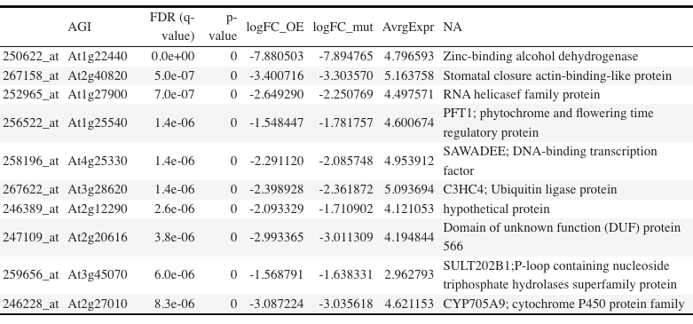
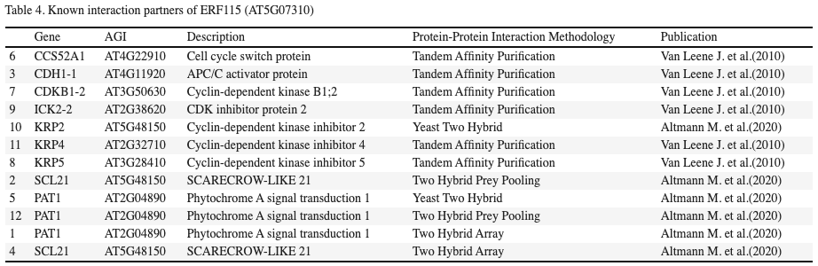

```{r global_options, include=FALSE, message=F, echo=F}
knitr::opts_chunk$set(fig.align = 'center')
knitr::opts_chunk$set(out.width = '90%')
knitr::opts_chunk$set(fig.width=12, fig.height=8)

library(ggplot2)
library(dplyr)
library(affy)
library(arrayQualityMetrics)
library(ArrayExpress)
library(limma)
library(siggenes)
library(oligo)
library(kableExtra)
library(gplots)
library(tibble)
```


\newpage
# 1. Import Microarray data

## Intensity values

Retreive the microarray daata and display the head and dimensions of the intensity value matrix.

```{r, message=F, warning=F}
id2 <- "E-GEOD-48836"

exonCELs2 <- oligoClasses::list.celfiles("./")
erfExp.raw <- oligo::read.celfiles(paste(rep("./", length(exonCELs2)),exonCELs2,sep=""))
```

```{r}
dim(exprs(erfExp.raw))
```

```{r}
head(exprs(erfExp.raw))
```

# 2. Quality control

## Quality control of raw data
Renter a report by using function `arrayQualityMetrics`.
```{r}
#arrayQualityMetrics(ma.raw2, force=T) # raw data
#arrayQualityMetrics(ma.raw2, force=T,do.logtransform=T) # log-transformed
```


# 3. Pre-processing the data

**Normalise your data using `rma` function**
RMA is a standard method for normaliation that only uses PM probes.
Background correction to correct for spatial variation within individual arrays: *a background-corrected intensity is calculated for each PM probe in a way that all back ground corrected intensities are positive*.

The `rma()` method produces a data matrix for arrays.
```{r}
erf.rma <- oligo::rma(erfExp.raw) # normalised data using RMA
erf.rma
```

## Quality control on post-preprocessed data
```{r}
#arrayQualityMetrics(erf.rma, outdir="~/Desktop/Workspace_Matlab_R/R/AHTA_Workspace/Project/Microarray2/", force=T) # RMA-noramlised data
```

# 4. Identification of Differential Expression Genes (DEGs)

```{r}
#limmaUsersGuide()
```

## Retrieve annotation

This experiment was set up to identify the transcriptional targets of ETHYLENE RESPONSE FACTOR 115 (ERF115) transcription factor. ERF115 expression is situated in the quiescent centre (QC) cells. In order to achieve that, the research group generated an overexpression line (p35S::ERF115 ORF), knock out mutant line of ERF115 (*erf115* provided by SALK_021981) and compare the transcriptional differences to the wild type *Arabidopsis thaliana* (Col-0). Three replicates of each lines had their root tips harvested for transcript profiling. Since we would like to see the clear effect of overexpression/absence of the *ERF115* gene, we would include all the data and look into all samples. Therefore, two sets of 1-1 pair-wise comparison will be performed.

```{r}
sdrf.erfExp <- read.delim("./E-GEOD-48836.sdrf.txt")
sdrf.erfExp[c(3,6,9,1,4,7,2,5,8),c("Source.Name","Characteristics..organism.", "FactorValue..genotype.")]
```

Retrieve the organism name

```{r}
sdrf.erfExp[,9]
```

This database sample annotation contains the source of the sample, *Arabidopsis thaliana*.

```{r}
# Factorize the name of the groups using factor() method
f=factor(sdrf.erfExp$FactorValue..genotype.)
f
```

## Create a design matrix and calculate mean expression to compare

Create a design matrix of values of grouped variables, which can be used in ANOVA or t-test while using `limma`.
Calculate the mean expression levels using `lmFit()` method, which will fit a **linear model** defined in the **design**.

```{r}
design=model.matrix(~0+f)
colnames(design)<-c("erf115","ERF115_OE","WT")
design

ERF.fit=lmFit(erf.rma, design)
```

View the results of the fit.

```{r}
ERF.fit$coefficients[1:10,] #show estimates of mean log expression of the fit of first 10 probe sets
```

## Create pair-wise contrasts 

Make pair-wise comparisons between two pairs of groups: *erf115* mutant versus Col-0 (wildtype), and ERF115 overexpression versus Col-0 (wildtype).
Use the column names of the design matrix specified in the previous section.

```{r}
contrast.matrix<-makeContrasts(ERF115_OE-WT, erf115-WT, levels=design)
contrast.matrix
```


```{r}
ERF.fit.2<-contrasts.fit(ERF.fit, contrast.matrix)
```


Perform a t-test, using *Empirical Bayes* method to lower influence of outliers.
Information is combined accrossed genes to improve performance via *moderation* method using `eBayes()` function.

```{r}
ERF.fit2.eb<-eBayes(ERF.fit.2)
```


### LIMMA output

```{r}
LIMMAout<-topTable(ERF.fit2.eb, adjust="BH", number=nrow(exprs(erf.rma)))
LIMMAout<-LIMMAout[c(1,2,3,4,5,6)]
```

## Summary of the result 

```{r}
summary(decideTests(ERF.fit2.eb))
```

\newpage
## Volcano plot

**ERF115 overexpression vs. WT**
```{r,fig.cap="Volcano plot of ERF115 overexpression vs. WT expression level"}
#jpeg("Volcanoplot-ERF115_overexpression.jpg")
volcanoplot(ERF.fit2.eb, coef=1, col=as.factor(LIMMAout$adj.P.Val<0.05),
            style="p-value", highlight=10)
dev.off()
```
***erf115* mutant vs. WT**
```{r,fig.cap="Volcano plot of erf115 knockout mutant vs. WT expression level"}
#jpeg("Volcanoplot-erf115_overexpression.jpg")
volcanoplot(ERF.fit2.eb, coef=2, col=as.factor(LIMMAout$adj.P.Val<0.05),
            style="p-value", highlight=10)
```

## MA Plot

**ERF115 overexpression vs. WT**
```{r,fig.cap="MA plot of ERF115 overexpression vs. WT expression level"}
#jpeg("MAplot-ERF115-overexpression.jpg")
plot(LIMMAout$AveExpr, LIMMAout$ERF115_OE...WT, col=as.factor(LIMMAout$adj.P.Val<0.05),
     pch=20,cex=0.5,xlab="Average Intensities: ERF115 overexpression vs. WT", ylab="logFC")
```

***erf115** mutant vs. WT**
```{r,fig.cap="MA plot of erf115 knockout mutant vs. WT expression level"}
#jpeg("MAplot-erf115-overexpression.jpg")
plot(LIMMAout$AveExpr, LIMMAout$erf115...WT, col=as.factor(LIMMAout$adj.P.Val<0.05),
     pch=20,cex=0.5,xlab="Average Intensities: erf115 mutant vs. WT", ylab="logFC")
```

* we want to see horizontal distribution
* significant gene will be located at the top or bottom, coloured in red


## Check intensity values for top results

```{r}
exprs(erf.rma)[rownames(exprs(erf.rma))%in%rownames(head(LIMMAout,1)),]
```

* array number 3, 6, 9 have high expression values
* logFC indicates the difference between the average expression between this two groups
* the values are already log-normalised, therefore is NOT a raw intensity comparision


## Mean expression of top 6 probes

```{r}
rowMeans(exprs(erf.rma)[rownames(exprs(erf.rma))%in%rownames(head(LIMMAout)),c(3,6,9)])
```

```{r}
rowMeans(exprs(erf.rma)[rownames(exprs(erf.rma))%in%rownames(head(LIMMAout)),c(1,2,4,5,7,8)])
```

# 5. Annotation

```{r}
Annot_MA<-read.table("A-AFFY-2.adf.txt", header=T, skip=19, sep="\t", fill=T)
Annot_MA%>%head
```

```{r}
dim(Annot_MA)
dim(LIMMAout)
```

The dimension of object `Annot_MA` and `LIMMAout` is different, therefore only the overlapping probesets between the two will be used for further annotation of the top genes.

```{r}
#Change Annot_MA to human-readable object
Annot_MA<-Annot_MA[58:22810,]
Annot_MA<-Annot_MA[,c(1,4:10)]
colnames(Annot_MA)<-c("Probe","Gene","Nickname","X.1","X.2","X.3","X.4","X.5")

head(Annot_MA)
head(LIMMAout)
```

```{r}
#Check dimension again
dim(Annot_MA) #22573 entries
dim(LIMMAout)  #22810 entries
```

Now, the dimension of the two data frame is equal.
```{r}
# Select only overlapping probesets to the Annot_MA
Annot_MA<-Annot_MA[Annot_MA$Probe %in% rownames(LIMMAout),]
LIMMAout<-LIMMAout[rownames(LIMMAout) %in% Annot_MA$Probe,]
dim(Annot_MA) # 22746 entries
dim(LIMMAout) # 22746 entries

sum(Annot_MA$Probe==sort(rownames(LIMMAout))) #0=EQULAITY CHEKCED!
```

```{r}
# Sort LIMMA output alphabetical on probe name
LIMMAout_sorted<-LIMMAout[sort(rownames(LIMMAout), index.return=T)$ix,]
```

```{r}
# Add gene names to LIMMA output
LIMMAout_sorted$gene<-Annot_MA$Gene
LIMMAout_annot<-LIMMAout_sorted[sort(LIMMAout_sorted$adj.P.Val, index.return=T)$ix,]
```

\newpage
# 6. Differentially expressed genes (DEG)

Now, the LIMMA output is sorted according to the **adjusted P-values** with the gene name.

```{r}
LIMMAout_annot %>% head

# Save results in a csv file
write.csv(LIMMAout_annot, file="MA2_DEGs.csv")
```

\newpage
## Top 10 DEGs
```{r}
LIMMAout_top10 <- LIMMAout_annot[(LIMMAout_annot$adj.P.Val<0.005)&(abs(LIMMAout_annot$ERF115_OE...WT)>0),][1:10,]
LIMMAout_top10 <- LIMMAout_top10[c(7,6,5,1,2,3)]
LIMMAout_top10$Description <- c("Zinc-binding alcohol dehydrogenase", 
                                "Stomatal closure actin-binding-like protein",
                                "RNA helicasef family protein", 
                                "PFT1; phytochrome and flowering time regulatory protein",
                                "SAWADEE; DNA-binding transcription factor",
                                "C3HC4; Ubiquitin ligase protein",
                                "hypothetical protein", 
                                "Domain of unknown function (DUF) protein 566",
                                "SULT202B1;P-loop containing nucleoside
                                triphosphate hydrolases superfamily protein",
                                "CYP705A9; cytochrome P450 protein family"
                                )
colnames(LIMMAout_top10) <- c("AGI", "FDR (q-value)", "p-value", "logFC_OE", 
                              "logFC_mut", "AvrgExpr")
```

```{r, fig.cap="Top 10 DEGs with gene symbol and description from TAIR10"}

```


## Top 50 DEGs
```{r}
# Significant probes (FDR < 0.001)
LIMMAout_top50 <- LIMMAout_annot[(LIMMAout_annot$adj.P.Val<0.001)&(abs(LIMMAout_annot$ERF115_OE...WT)>0),][1:50,]
LIMMAout_top50 <- LIMMAout_top50[c(7,6,5,1,2,3)]
colnames(LIMMAout_top50) <- c("AGI", "FDR (q-value)", "p-value", 
                              "logFC_OE", "logFC_mut", "AvrgExpr")


# Final list of 50 upregulated DEGs
LIMMAout_top50 %>%
  kbl(caption = "Top 50 upregulated genes in ERF115 overexpression lines", 
      longtable = F, booktab=T) %>% kable_classic('striped', html_font = "Cambria")
```

\newpage
# 7. Visualisation of DEGs by Heat Map

Create a matrix compatible to make a heat map
```{r,warning=F,message=F}
selected <- p.adjust(ERF.fit2.eb$p.value[,2])<0.05
esetSel <- erf.rma[selected,]
exp <- exprs(esetSel) 

exp <- as.data.frame(exp)
colnames(exp) <- c("WT_1", "erf115_1", "ERF115_1","WT_2", "erf115_2", 
                   "ERF115_2", "WT_3", "erf115_3", "ERF115_3")
exp <- exp[,c(1,4,7,3,6,9,2,5,8)]

# Merge with AGI accession number
exp_MA <- tibble::rownames_to_column(as.data.frame(exp), "Probe")
exp <- dplyr::left_join(exp_MA, Annot_MA[,1:2], 
                        by="Probe")[,c(11,2,3,4,5,6,7,8,9,10)]

# Change the gene column to rowanames
row.names(exp) <- exp$Gene
exp[1] <- NULL
# Change back to matrix to create heat map
hm <- as.matrix.data.frame(exp)
```

```{r,fig.cap="Heat map of differentially expressed genes",fig.height=10, fig.width=12, echo=F}
# Create heat map
#jpeg(filename="Heatmap_MA2.jpg", width=480, height=480, units="px", bg="white")
heatmap.2(hm, col=redgreen(75), scale="none", key=TRUE, symkey=TRUE, 
          density.info="none", trace="none", cexRow=1, 
          dendrogram = "row", margin=c(6,10),
          srtCol = 45, adjCol = c(1,1),# tilt the columns (sample names)
          main="Heatmap of DEGs", xlab = "Samples", ylab = "Genes"
          )
#dev.off()
```


# 8. Gene set analysis

With Gene Set Analysis, we can figure out which biological processes have a up/downregulation in *ERF115* overexpression line and *erf115* knock-out mutant compared to wild type Arabidopsis.
However, the GO enrichment analysis failed because there was no GO term enrichment available.

# 9. Interacting partners of ERF115

From the LIMMA output containing significant genes with FDR < 0.05, there were several genes (in AGI accession number) found in the *ERF115* overexpression line.

Subset for significant probes, a more strict cut-off for significant probes is used to prevent from probe over-saturation.
```{r}
# Significant genes
sign <- LIMMAout_annot[(LIMMAout_annot$adj.P.Val<0.001)&(abs(LIMMAout_annot$ERF115_OE...WT)>1),] # 94 significant genes filtered to be highly significant (***)
sign <- sign[,c(7,1,3,5)]
colnames(sign) <- c("AGI", "logFC", "AvgExpr", "P.Value")

sign %>% kbl(caption = "List of highly significant DEGs in ERF115 
             overexpression lines", longtable=T, booktabs = T) %>%
   kable_styling(latex_options="striped", position="center", full_width=F)

```

## List of known interaction partners from ERF115 (AT5G07310) retrieved from IntAct
```{r, echo=F}
# Import the known interaction partners of ERF115 (AT5G07310) using IntAct (ebi.ac.uk)
partners <- read.table("ERF115_partners.txt", sep="\t")
partners$Gene <- c("PAT1", "SCL21", "CDH1-1", "SCL21", "PAT1", "CCS52A1", 
                   "CDKB1-2", "KRP5", "ICK2-2","KRP2", "KRP4", "PAT1")
partners$AGI <- c("AT2G04890", "AT5G48150", "AT4G11920", "AT5G48150",
                  "AT2G04890", "AT4G22910","AT3G50630", "AT3G28410", 
                  "AT2G38620", "AT5G48150", "AT2G32710", "AT2G04890")
partners$Description <- c("Phytochrome A signal transduction 1", 
                          "SCARECROW-LIKE 21", "APC/C activator protein",
                          "SCARECROW-LIKE 21", 
                          "Phytochrome A signal transduction 1",
                          "Cell cycle switch protein", 
                          "Cyclin-dependent kinase B1;2",
                          "Cyclin-dependent kinase inhibitor 5",
                          "CDK inhibitor protein 2",
                          "Cyclin-dependent kinase inhibitor 2",
                          "Cyclin-dependent kinase inhibitor 4",
                          "Phytochrome A signal transduction 1")
partners <- partners[c(6,3,7,9,10,11,8,2,5,12,1,4),c(16,17,18,7,8)]
partners[,4] <- c("Tandem Affinity Purification", "Tandem Affinity Purification", 
                  "Tandem Affinity Purification","Tandem Affinity Purification",
                  "Yeast Two Hybrid", "Tandem Affinity Purification",
                  "Tandem Affinity Purification","Two Hybrid Prey Pooling",
                  "Yeast Two Hybrid","Two Hybrid Prey Pooling",
                  "Two Hybrid Array", "Two Hybrid Array")
colnames(partners) <- c("Gene", "AGI", "Description", 
                        "Protein-Protein Interaction Methodology", "Publication")

#partners %>% 
 # kbl(caption = "Table 4. Known interaction partners of ERF115 (AT5G07310)",longtable=T, booktabs = T) %>%
  #  kable_classic("striped", position="center", full_width=T, html_font="Cambria")


```