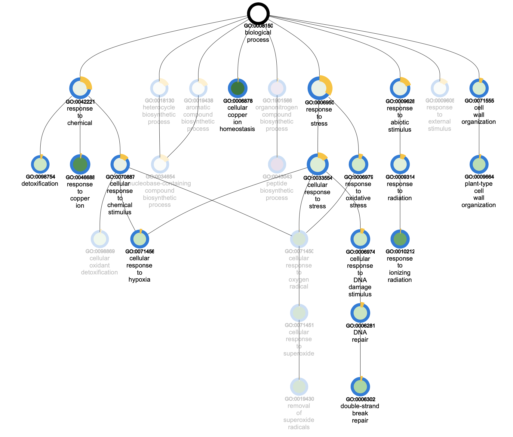

```{r global_options, include=FALSE, message=F, echo=F}
knitr::opts_chunk$set(fig.align = 'center')
knitr::opts_chunk$set(out.width = '60%')
knitr::opts_chunk$set(fig.width=12, fig.height=8)

#BiocManager::install("limma",update=F) if the package is not installed yet

library(ggplot2)
library(dplyr)
library(edgeR)
library(biomaRt)
library(DESeq2)
library(huex10sttranscriptcluster.db)
library(tximport)
library(ComplexHeatmap)
library(RColorBrewer)
library(circlize)
library(kableExtra)
```

\newpage
# 1. Import RNA-seq Data

The GTF annotation file for - *Arabidopsis thaliana* can be retrieved from TAIR10. Therefore, same method was used as implemented in the RNA-seq dataset.

### Retrieve transcript annotation
```{r}
tair10 <- useEnsembl(biomart="plants_mart", host="https://plants.ensembl.org",
                     dataset="athaliana_eg_gene")

# What are the available attributes
atr <- listAttributes(tair10)
#atr[grepl('go_id', atr$name),]

data <- getBM(attributes=c('ensembl_gene_id', 'ensembl_transcript_id', 
                           'tair_symbol', 'go_id', 'name_1006'),
              mart=tair10)

tx2geneGtf <- dplyr::select(data, ensembl_transcript_id, ensembl_gene_id, tair_symbol)
tx2geneGtf <- dplyr::rename(tx2geneGtf, TXNAME = ensembl_transcript_id)
tx2geneGtf <- dplyr::rename(tx2geneGtf, GENEID = ensembl_gene_id)
tx2geneGtf <- dplyr::rename(tx2geneGtf, SYMBOL=tair_symbol)
#tx2geneGtf <- dplyr::rename(tx2geneGtf, GOID=go_id)
#tx2geneGtf <- dplyr::rename(tx2geneGtf, GOterm=name_1006)

tx2geneGtf %>% head
```

### Load the RNA-seq data set

```{r, warning=F, message=F}
# Get file locations
files.rna <- list.files("./kallisto_quant/")
files.rna <- files.rna[grep("abundance.tsv", files.rna)]
samples.rna <- unlist(strsplit(files.rna,"_"))[c(1:length(files.rna))*2-1]
files.rna <- paste(rep("./kallisto_quant/", length(files.rna)), files.rna, sep="")
names(files.rna) <- samples.rna

# Load RNAseq data
txi.rna <- tximport(files.rna, type="kallisto", tx2gene=tx2geneGtf)
```

```{r}
head(txi.rna$counts)
```

```{r}
dim(txi.rna$counts)
```

# 2. Preprocessing Data

## Quality control

multiQCreport will be explained separately in the article, referring to the later part of this analysis report.


```{r}
# Over-represented sequences from the multiQC of raw data
read.delim("./Overrepresented_seq.fa", header=F, sep="\n")
```

## Get annotation information

```{r}
sdrf_rnaseq <- read.table("./SraRunTable.txt", header=T, sep=",")
sdrf_rnaseq %>% dplyr::select("source_name", "Platform", "Assay.Type", "Run")
```

\newpage
## Preprocessing PBS script

Preprocessing has been performed by running on `HPC-UGent`, Flemish Supercomputer Center (VSC) virtual organization.
The shell script `RNApreprocessingPipeline_Kallisto.pbs` is used and attached at section 

After preprocessing and pseudoalignment with Kallisto, the duplicate reads and overrepresented (possibly adapter) sequences have been removed.
All samples passed the test in fastQC analaysis, ready to be proceeded to the next step.

### Check for duplicate rows
```{r}
sum(duplicated(rownames(txi.rna$counts))) #duplicated rows none
```

The samples are divided into two groups - wild type of *Arabidopsi thaliana* Col-0 without any treatment (`Col-0`), and those upon bleomycin treatment (`BLM`)
```{r}
treatment <- factor(c("Col-0", "Col-0", "Col-0", "BLM", "BLM", "BLM"))
treatment
```

\newpage
# 3-1. Statistical analysis (DESeq2)

## Prepare objects for `DESeq2` analysis
```{r}
sampleTable <- data.frame(condition = treatment)
rownames(sampleTable) <- colnames(txi.rna$counts)


dds <- DESeqDataSetFromTximport(txi.rna, sampleTable, ~condition)
dds
```

## Differential expression analysis

```{r, message=F, warning=F}
dds <- DESeq(dds)
results(dds)

res_DESeq <- results(dds)
res_DESeq_ori <- res_DESeq
res_DESeq <- res_DESeq[order(res_DESeq$padj),]
res_DESeq <- res_DESeq[is.na(res_DESeq$padj)==F,]
```


## Sort the DEGs and add gene symbols from annotation
```{r}
data_sorted_DESeq <- data[sort(data$ensembl_gene_id, index.return=T)$ix,]
data_sorted_DESeq <- data_sorted_DESeq[!duplicated(data_sorted_DESeq$ensembl_gene_id),]

res_DESeq <- cbind(rownames(res_DESeq),res_DESeq)
colnames(res_DESeq)[1] <- "Ensembl_gene_id"
res_DESeq_sorted <- res_DESeq[sort(res_DESeq$Ensembl_gene_id, index.return=T)$ix,]
data_sorted_DESeq <- data_sorted_DESeq[data_sorted_DESeq$ensembl_gene_id%in%res_DESeq_sorted$Ensembl_gene_id,]

# Check dimension to see if it is identical
dim(res_DESeq_sorted) #20605 rows
dim(data_sorted_DESeq) #20605 rows -> identical!

# Add gene symbol column
res_DESeq_sorted$Gene_symbol <- data_sorted_DESeq$tair_symbol

head(res_DESeq_sorted)
```

## Resort and save results

```{r, message=F, warning=F}
res_DESeq <- res_DESeq_sorted[sort(res_DESeq_sorted$pvalue,index.return=T)$ix,]

# Save results into .txt file
write.table(res_DESeq,file="res_DESeq_ArabidopsisThaliana.txt",col.names = T,row.names = T,sep="\t",quote = F)

# Select significant ones only (below q-value < 0.05)
res_DESeq_sign <- res_DESeq[res_DESeq$padj<0.05,] # 3180 significant DEGs

# Save significant results into .csv file
write.csv(res_DESeq_sign,file="res_DESeq_significant.csv",col.names=T, row.names=T, sep="\t",quote=F)
```

## Top 30 Differentially expressed genes (DEGs)
```{r,echo=F}
res_DESeq[1:30,c(1,8,7,3)] %>% 
  kbl(caption='Table 1. List of top 30 significant DEGs in BLM treated root tip samples', longtable = T, booktabs = T) %>%
    kable_classic('striped',position='center',full_width=F, html_font='Cambria')
```

\newpage
## Plot dispersion estimates
```{r, fig.cap="Plot dispersion plot"}
plotDispEsts(dds)
```

### MA plot

```{r, fig.cap="MA plot"}
plotMA(res_DESeq_ori)
```

\newpage
# 3-2. Statistical analysis (edgeR)

### Make TPM values compatible with edgeR
```{r}
cts <- txi.rna$counts
normMat <- txi.rna$length

# Obtain pre-observation scaling factors for length, adjusted to avoid changing the magnitude of counts
normMat <- normMat/exp(rowMeans(log(normMat)))
normCts <- cts/normMat
```

### Identify effective library size from scaling factors, to account for composition biases between samples
```{r}
eff.lib <- calcNormFactors(normCts)*colSums(normCts)

# Combine effective sizes with the length factors and calculate offsets for a log-link GLM
normMat <- sweep(normMat, 2, eff.lib, "*")
normMat <- log(normMat)
```

### Create a DEGList object for edgeR
```{r}
l <- DGEList(cts)
l <- scaleOffset(l, normMat)
```

### Library sizes
```{r, fig.cap="Boxplot of effective libary size"}
eff.lib
#jpeg("library_sizes_ArabidopsisThaliana.jpg")
boxplot(eff.lib~as.factor(treatment),xlab="group",ylab="library size")
wilcox.test(eff.lib~as.factor(treatment))
```

### Optionally filter on counts mean
```{r}
cutoff <- 3/(mean(l$samples$lib.size)/1000000)
keep <- rowSums(cpm(l)>cutoff) >= 3
l <- l[keep, keep.lib.sizes=FALSE]
summary(keep)
```

\newpage
## MDS plot
Make and MDS plot to see if BLM-treated and mock plants show clear separation
```{r, fig.cap="MDS plot"}
#jpeg("plotMDS_ArabidopsisThaliana.jpg")
par(mar=c(6,6,6,6))
plotMDS(l, col=as.numeric(as.factor(treatment)))
par(xpd=T)
legend(par("usr")[2]*1.1,par("usr")[4]*0.8,sort(unique(treatment)),
       pch=c(16), col=as.double(as.factor(sort(unique(treatment)))))
```

## Estimating dispersion and BCV plot

```{r, fig.cap="BCV plot"}
d <- model.matrix(~treatment)
rownames(d) <- colnames(l)

l <- estimateDisp(l, d)
#jpeg("BCVplot_ArabidopsisThaliana.jpg")
plotBCV(l)
```

```{r}
fit.edgeR <- glmQLFit(l, d)
qlf.edgeR <- glmQLFTest(fit.edgeR, coef=2)

# coef=2 means BLM treated vs. control
# note: standard, the last column is considered as the contrast of interest

res.edgeR <- topTags(qlf.edgeR, n=nrow(qlf.edgeR$table))$table
res.edgeR %>% head # Top results
```

## QQ plot

Make a QQ plot to evaluate the goodness of fit.
```{r, fig.cap="QQ plot"}
gof(fit.edgeR, plot=TRUE)
```

## Volcano plot

```{r}
#\jpeg("res_edgeR_ArabidopsisThaliana.jpg")
with(res.edgeR, plot(logFC, -log10(PValue), pch=16, cex=0.2))
with(res.edgeR, points(logFC[FDR<0.05&abs(logFC)>1.5], -log10(PValue)[FDR<0.05&abs(logFC)>1.5],pch=16, col="red",cex=0.6))
abline(0,0) #x-axis
```

\newpage
# 4. Heat Map

```{r}
df <- as.data.frame(res_DESeq_sign, row.names = TRUE)
df.top <- df[(df$padj<0.001)&(df$baseMean>25)&(abs(df$log2FoldChange)>2),]
df.top %>% dim #unbase mean filtered narrow downed to 135 genes
```

```{r}
df.top <- df.top[order(df.top$log2FoldChange, decreasing=TRUE),] #all positive DEGs at the top -? downregulated DEGs
df.top %>% head
```

```{r}
# Add annotations manually to the NA columns
symbols <- read.table(file="topDEGs_with_symbols.txt", sep=" ")
df.top[7] <- symbols
```

```{r}
# Get normalised data from dds object
rlog_out <- rlog(dds, blind=FALSE)
# Create a matrix of significant genes x samples
m <- assay(rlog_out)[rownames(df.top), rownames(sampleTable)]
colnames(m) <- c("WT-1", "WT-2", "WT-3", "BLM-1", "BLM-2", "BLM-3")
base_mean <- rowMeans(m)

# Center and scale each column (Z-score), then transpose the matrix
m.scaled <- t(apply(m, 1, scale)) 
colnames(m.scaled) <- colnames(m)

# Check the matrix
head(m.scaled)
```


```{r}
num_keep <- 50 # Top and bottom 50 genes are selected
rows_keep <- c(seq(1:num_keep), seq((nrow(m.scaled)-num_keep), nrow(m.scaled)))
```

### Get values of 2 extra columns
```{r}
# Get log2 values for each gene we are keeping
l2.val <- as.matrix(df.top[rows_keep,]$log2FoldChange)
colnames(l2.val) <- "logFC"

# Get mean value for each gene we are keeping
l2.mean <- as.matrix(df.top[rows_keep,]$baseMean)
colnames(l2.mean) <- "AvgExpr"
```

### Create a color map for `logFC` and `AvgExpr` values
```{r}
# Get a list of color values
col1 <- brewer.pal(9, "YlGnBu")

# Map values betweeb blue/white/red for min and max 12 values
col_logFC <- colorRamp2(c(min(l2.val),0,max(l2.val)),c("blue","white","red"))

# Map values between 0% quantile and 75% quantile of mean values - 0, 25, 50, 75, 100
col_AvgExpr <- colorRamp2(c(quantile(l2.mean)[1], quantile(l2.mean)[4]), c("white", "limegreen"))
```


```{r, warning=F}
# Adjust the annotation of boxplot (filled colour, height)
ha <- HeatmapAnnotation(summar=anno_summary(gp=gpar(fill=2),
                                            height=unit(2,"cm")))

h1 <- Heatmap(m.scaled[rows_keep,], cluster_rows = F,
              column_labels = colnames(m.scaled), name="Z-score",
              cluster_columns = T)

h2 <- Heatmap(l2.val, row_labels=df.top$Gene_symbol[rows_keep],
              cluster_rows=F, name="logFC", top_annotation = ha, col=col_logFC,
              cell_fun=function(j,i,x,y,w,h,col){#add text to each grid
                grid.text(round(l2.val[i,j],2),x,y)
                })


h3 <- Heatmap(l2.mean, row_labels=df.top$Gene_symbol[rows_keep],
              cluster_rows=F, name="AvgExpr", col=col_AvgExpr,
              cell_fun=function(j,i,x,y,w,h,col){# Add text to each grid
                grid.text(round(l2.mean[i,j],2),x,y)
                })

h <- h1 + h2 + h3
```

```{r, fig.cap="Heatmap of differentially expressed genes", fig.align='center', fig.width=10, fig.height=20}
h
```


```{r}
# Save results in jpg file
jpeg(filename="Heatmap_RNA-seq.jpg", width=800, height=1200, units="px", bg="white")
h

# Save top 50 DEG results in csv file
write.csv(df.top, file="RNAseq_top50DEGs.csv")
```


# 5. Gene set analysis

With Gene Set Analysis, we can figure out which biological processes have a up/downregulation in BLM-treated samples to wild type Arabidopsis.

```{r}
gs <- df[(df$padj<0.05)&(df$baseMean>50)&(abs(df$log2FoldChange)>1),]
gs %>% dim #unbase mean filtered narrow downed to 315 genes

gs <- gs[order(gs$log2FoldChange, decreasing=TRUE),]
gs%>% head

write.csv(gs, file="RNAseq_genesetanalysis.csv")
```


## Compute GO enrichment analysis in PLAZA 5.0 Workbench

GO enrichment analysis is computed with top 50 upregulated and downregulated DEGs, using PLAZA 5.0 Workbench platform.
```{r}
go.term <- read.csv(file="GOenrichment_RNAseq.csv", header = TRUE)
go.term$FDR <- p.adjust(go.term$P.Value, method="BH")
go.term <- go.term[,c(1,6,2,3,4,8,5)]
colnames(go.term) <- c("GOTerm", "Description", "Ontology", "logFC", "P.Value",
                       "FDR", "Subset ratio(%)")
go.term <- go.term[go.term[,"Ontology"]=="BP",]
```

```{r, fig.align='center', fig.width=12}
library(kableExtra)

go.term[,c(1,2,4,6,7)] %>%
  kbl(caption = "Overview of GO Enrichment Analysis") %>%
  kable_classic('striped',full_width=F, html_font = "Cambria")
```

## Biological Pathways enriched from the DEGs
```{r, fig.width=25, fig.height=9, fig.cap="Graphic representation of bioloigcal pathways from GO Enrichment Analysis"}

```

# 6. PBS Files

## RNApreprocessingPipeline_Kallisto.pbs

```
#!/usr/bin/env bash

#PBS -l nodes=1:ppn=8
#PBS -l walltime=00:59:00
#PBS -l mem=8gb

# Load the necessary modules
module load Trimmomatic/0.39-Java-11
module load MultiQC/1.9-intel-2020a-Python-3.8.2
module load FastQC/0.11.9-Java-11
module load kallisto/0.46.1-iimpi-2020a
module load parallel-fastq-dump/0.6.6-GCCcore-9.3.0-SRA-Toolkit-3.0.0-Python-3.8.2
module load TopHat/2.1.2-gompi-2020a

# Change to the directory you are working in 
cd /data/gent/vo/000/gvo00095/Courses/AHTA/Group16/RNAseq

# Create Pseudo Transcriptome
gtf_to_fasta Arabidopsis_thaliana.TAIR10.37.gtf 
  Arabidopsis_thaliana.TAIR10.dna.toplevel.fa Arabidopsis_PseudoTranscriptome.fa

# Create index
kallisto index -i Arabidopsis_index Arabidopsis_PseudoTranscriptome.fa

# Make a directory to store kallisto logs
mkdir kallisto_logs

# For loop over all samples
for ID in SRR10382303 SRR10382304 SRR10382305 SRR10382306 SRR10382307 SRR10382308
do 
	# Echo the ID you are processing
	echo $ID
	
	# Load the first (-X 500000) 500,000 reads for the ID (--sra-id $ID) you are
	  processing using 8 cores (--threads 8)
	parallel-fastq-dump --sra-id $ID --threads 8
	
	# Perform trimming based on the quality score (-phred33) with a sliding window 
	    (SLIDINGWINDOW:4:15) using 8 cores (-threads 8)
	# storing the results in $ID\_trimQuality.fastq
	java -jar $EBROOTTRIMMOMATIC/trimmomatic-0.39.jar SE -threads 8 -phred33 
	  $ID.fastq $ID\_trimQuality.fastq SLIDINGWINDOW:4:15
	java -jar $EBROOTTRIMMOMATIC/trimmomatic-0.39.jar SE -threads 8 -phred33 
	    $ID\_trimQuality.fastq $ID\_trimBoth.fastq ILLUMINACLIP:Adapters.fa:2:30:10
	
	# Perform QC with fastqc on the trimmed reads outputting everything in the 
	  fastqc folder (--outdir fastqc)
	fastqc --outdir . $ID\_trimQuality.fastq
	fastqc --outdir . $ID\_trimBoth.fastq
	
	# Make directory to output alignment results
	mkdir $ID\_quant

	# Pseudo-alignment using kallisto
	kallisto quant -i Arabidopsis_index -o $ID\_quant -t 8 --single -l 100 -s 1 
	  -g Arabidopsis_thaliana.TAIR10.37.gtf $ID\_trimBoth.fastq &> kallisto_logs/$ID\_kallisto.log
	
	# Change numeric ids in kallisto output with gene IDs
	grep ">" Arabidopsis_PseudoTranscriptome.fa | cut -d" " -f 2 
	  > $ID\_quant/transcriptIDs.txt
	awk '{OFS = "\t"} FNR==NR{a[NR+1]=$1;next}{if(FNR!=1){$1=a[FNR]}}1' 
	  $ID\_quant/transcriptIDs.txt $ID\_quant/abundance.tsv > $ID\_quant/abundance_bis.tsv
	mv $ID\_quant/abundance_bis.tsv $ID\_quant/abundance.tsv
	
	# Remove fastq files to reduce disk usage
	rm $ID.fastq
	rm $ID\_trimQuality.fastq
	rm $ID\_trimBoth.fastq
done

# Make directory to output all alignment
mkdir kallisto_quant
# Put all kallisto output files in one directory (easier for downloading and
  downstream processing with Rstudio!)
for ID in SRR10382303 SRR10382304 SRR10382305 SRR10382306 SRR10382307 SRR10382308
do
	mv $ID\_quant/abundance.h5 kallisto_quant/$ID\_abundance.h5
	mv $ID\_quant/abundance.tsv kallisto_quant/$ID\_abundance.tsv
	mv $ID\_quant/run_info.json kallisto_quant/$ID\_run_info.json
	rm -r $ID\_quant
done

# Use multiqc to make an overview of all quality control and log files performed 
# ("." option searches all files and subdirectories of the current working directory)
multiqc .
```

